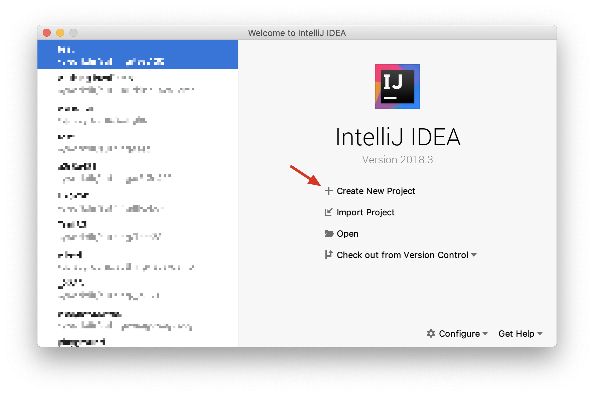
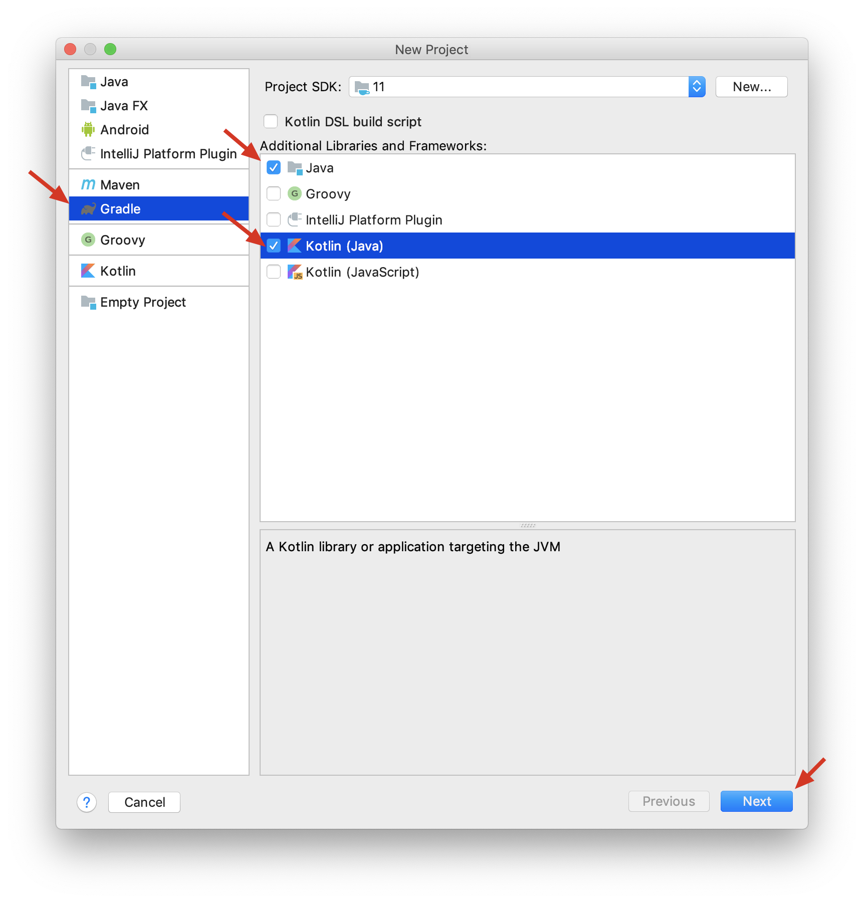
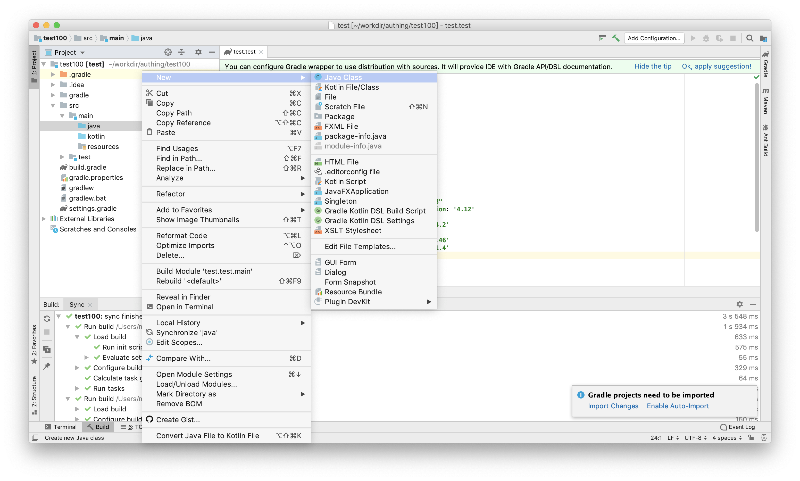

# Authing SDK for Java

[English](./README.md)

Authing SDK 版本 2.0.0

JDK 版本 1.8

Github 地址：[https://github.com/Authing/authing-java-sdk](https://github.com/Authing/authing-java-sdk)

JCenter 地址: [https://bintray.com/authing/AuthingSDK/Java](https://bintray.com/authing/AuthingSDK/Java)

# 安装

## 创建项目

在 IDEA 中新建一个项目



选择 Gradle，在右侧的额外依赖中勾选 Java 和 Kotlin：


填写其他信息：


## 添加依赖

进入 IDE，等待 Gradle 构建完毕，打开 build.gradle 文件：


在右侧红色箭头处增加以下内容：

```java
...
repositories {
    jcenter()
    mavenCentral()
}

dependencies {
    compile "org.jetbrains.kotlin:kotlin-stdlib-jdk8"
    testCompile group: 'junit', name: 'junit', version: '4.12'
    implementation "cn.authing:java-core:1.3.3"
    implementation 'com.squareup.okhttp3:okhttp:3.14.2'
    implementation 'com.google.code.gson:gson:2.8.5'
    implementation 'org.bouncycastle:bcprov-jdk15:1.46'
    implementation 'com.google.android:android:4.1.1.4'
}
...
```

如下图所示，根据提示开启 Auto-import 功能：


## 开始使用

在 java 文件夹下创建一个 Class，命名为 Demo。



在类的 main 函数中，引入 Authing 开始使用


> Android 注意
> 如果用于 Android 开发，需要在 AndroidManifest 文件中加入 INTERNET 权限。

```xml
<uses-permission android:name="android.permission.INTERNET"/>
```

# 快速上手

先从 Authing 控制台中获取 `UserPool ID` 和 `Secret`，然后实例化 `Authing` 类。

为了用户池的信息安全，`Secret` 只应在后端使用时传入。

```java
import cn.authing.core.Authing;

public class Demo {
    public static void main(String[] args) {
        // 可选参数：
        // secret：密钥，用来获取用户池管理员权限，需妥善保存，请勿在客户端传入
        // accessToken：用户的身份凭证，是调用某些接口的必要参数，可以通过调用登录接口获取，获取后即可传入。
        // host：Authing 的接口地址，默认为 https://core.authing.cn，私有化部署后需要修改此参数
        // publicKey：加密公钥，默认为 Authing 的公钥，私有化部署后需要修改此参数。公钥格式如下：
        // 
        // MIGfMA0GCSqGSIb3DQEBAQUAA4GNADCBiQKBgQC4xKeUgQ+Aoz7TLfAfs9+paePb
        // 5KIofVthEopwrXFkp8OCeocaTHt9ICjTT2QeJh6cZaDaArfZ873GPUn00eOIZ7Ae
        // +TiA2BKHbCvloW3w5Lnqm70iSsUi5Fmu9/2+68GZRH9L7Mlh8cFksCicW2Y2W2uM
        // GKl64GDcIq3au+aqJQIDAQAB
        //
        Authing client = new Authing("userPoolId", "secret");
    }
}
```

# 如何初始化参数对象

SDK 接口函数参数对象提供了两种初始化方式：

## 链式调用方式（推荐）

```java
import cn.authing.core.Authing;
import cn.authing.core.types.*;

public class Demo {
    public static void main(String[] args) {
        LoginByEmailParam param = new LoginByEmailParam().email("email").password("password").build();
    }
}
```

## setter 方式

```java
import cn.authing.core.Authing;
import cn.authing.core.types.*;

public class Demo {
    public static void main(String[] args) {
        LoginByEmailParam param = new LoginByEmailParam();
        param.setEmail("email");
        param.setPassword("password");
        param.build();
    }
}
```

# 调用方式

## 同步调用

SDK 提供了**同步**和**异步**两种调用方式，适用不同的场景。

若需要等待返回结果处理后面的数据，比较适合同步调用，例如：

```java
import cn.authing.core.Authing;
import cn.authing.core.types.*;

public class Demo {
    public static void main(String[] args) {
        Authing client = new Authing("userPoolId", "secret");
        // 登录失败会抛出错误
        LoginByEmailResponse response = client.loginByEmail(new LoginByEmailParam().email("email").password("password").build()).execute();
        System.out.println(response.getResult().getEmail());
    }
}
```

## 异步调用

如果不希望阻塞当前线程，则需使用异步调用（当然你也可以在子线程中使用同步调用），例如：

```java
import cn.authing.core.Authing;
import cn.authing.core.http.Callback;
import cn.authing.core.types.*;

public class Demo {
    public static void main(String[] args) {
        Authing client = new Authing("userPoolId", "secret");
        client.loginByEmail(new LoginByEmailParam().email("email").password("password").build()).enqueue(
        new Callback<LoginByEmailResponse>() {
                @Override
                public void onSuccess(LoginByEmailResponse response) {
                    response.getResult().getEmail();
                }
    
                @Override
                public void onFailure(ErrorInfo errorInfo) {
                    System.out.println(errorInfo.getCode());
                    System.out.println(errorInfo.getMessage());
                }    
        });
    }
}
```

# 错误处理

同步调用会抛出错误，异步调用在 `onFailure` 中会返回错误，你可以通过 `error.getCode()` 获取错误代码。了解更多报错的详情，请查看[错误代码列表](./README-cn.md#%E9%94%99%E8%AF%AF%E4%BB%A3%E7%A0%81)。

# 用户服务

## 用户注册

client.register(RegisterParam params)

需要在以下方式中选择一项：

- 手机号+验证码注册
- 手机号+密码注册
- 邮箱+密码注册
- 用户名+密码注册

params {RegisterParam}
  - params.email {String}，可选，用户邮箱
  - params.username {String}，可选，用户名
  - params.password {String}，可选，用户密码
  - params.phone {String}，可选，手机号
  - params.phoneCode {String}，可选，手机短信验证码
  - params.company {String}，可选，公司
  - params.lastIP {String}，可选，上次登录 IP 地址
  - params.oauth {String}，可选，用户社会化登录信息或其他自定义数据
  - params.photo {String}，可选，头像

示例：

```java
import cn.authing.core.Authing;
import cn.authing.core.types.*;

import java.io.IOException;

public class Demo {
    public static void main(String[] args) throws IOException {
        Authing client = new Authing("userPoolId", "secret");
        
        // 用户名密码注册 
        UserRegisterInput input = new UserRegisterInput().username("username").password("123456").build();

        // 邮箱密码注册
        // UserRegisterInput input = new UserRegisterInput().email("email").password("123456").build();

        // 手机号密码注册
        // UserRegisterInput input = new UserRegisterInput().phone("phone").password("123456").build();

        // 手机号验证码注册
        // UserRegisterInput input = new UserRegisterInput().phone("phone").phoneCode("1234").build();

        RegisterResponse response = client.register(new RegisterParam().userInfo(input).build()).execute();
        System.out.println(response.getResult().get_id());
    }
}
```

## 用户池管理员登录

client.loginBySecret()

此接口返回管理员的 accessToken，可以将其传入 client 中，以访问某些权限要求较高的接口。

示例：

```java
import cn.authing.core.Authing;
import cn.authing.core.types.*;

public class Demo {
    public static void main(String[] args) throws IOException {
        Authing client = new Authing("userPoolId", "secret");
        client.setAccessToken(client.loginBySecret().execute().getResult());
    }
}
```

## 邮箱+密码登录

client.loginByEmail(params)

- params {LoginByEmailParam}
  - params.email {String}，必填，用户邮箱
  - params.password {String}，必填，用户密码

示例：

```java
import cn.authing.core.Authing;
import cn.authing.core.types.*;

import java.io.IOException;

public class Demo {
    public static void main(String[] args) throws IOException {
        Authing client = new Authing("userPoolId", "secret");
        LoginByEmailParam param = new LoginByEmailParam().email("email").password("123456").build();
        LoginByEmailResponse response = client.loginByEmail(param).execute();
        System.out.println(response.getResult().getEmail());
    }
}
```

## 用户名+密码登录

client.loginByUsername(params)

- params {LoginByUsernameParam}
  - params.username {String}，必填，用户名
  - params.password {String}，必填，用户密码

示例：

```java
import cn.authing.core.Authing;
import cn.authing.core.types.*;

import java.io.IOException;

public class Demo {
    public static void main(String[] args) throws IOException {
        Authing client = new Authing("userPoolId", "secret");
        LoginByUsernameParam param = new LoginByUsernameParam().username("username").password("123456").build();
        LoginByUsernameResponse response = client.loginByUsername(param).execute();
        System.out.println(response.getResult().getEmail());
    }
}
```

## 手机号+验证码登录

client.loginByPhoneCode(params)

- params {LoginByPhoneCodeParam}
  - params.phone {String}，手机号
  - params.phoneCode {Int}，短信验证码

示例：

```java
import cn.authing.core.Authing;
import cn.authing.core.types.*;

import java.io.IOException;

public class Demo {
    public static void main(String[] args) throws IOException {
        Authing client = new Authing("userPoolId", "secret");
        LoginByPhoneCodeParam param = new LoginByPhoneCodeParam().phone("phone").phoneCode(1234).build();
        LoginByPhoneCodeResponse response = client.loginByPhoneCode(param).execute();
        System.out.println(response.getResult().getEmail());
    }
}
```

## 手机号+密码登录

client.loginByPhonePassword(params)

- params {LoginByPhonePasswordParam}
  - params.phone {String}，手机号
  - params.password {Int}，用户密码

示例：

```java
import cn.authing.core.Authing;
import cn.authing.core.types.*;

import java.io.IOException;

public class Demo {
    public static void main(String[] args) throws IOException {
        Authing client = new Authing("userPoolId", "secret");
        LoginByPhonePasswordParam param = new LoginByPhonePasswordParam().phone("phone").password("123456").build();
        LoginByPhonePasswordResponse response = client.loginByPhonePassword(param).execute();
        System.out.println(response.getResult().getEmail());
    }
}
```

## LDAP 登录

client.loginByLDAP(params)

- params {LoginByLdapParam}
  - params.username {String}，必填，用户名
  - params.password {String}，必填，密码

示例：

```java
import cn.authing.core.Authing;
import cn.authing.core.types.*;

import java.io.IOException;

public class Demo {
    public static void main(String[] args) throws IOException {
        Authing client = new Authing("userPoolId", "secret");
        LoginByLdapParam param = new LoginByLdapParam().username("phone").password("123456").build();
        LoginByLdapResponse response = client.loginByLdap(param).execute();
        System.out.println(response.getResult().getEmail());
    }
}
```

## 刷新 AccessToken

需要用户池管理员的 AccessToken。

client.refreshToken(params)

- params {RefreshTokenParam}
  - params.userId {String}，必填，用户 ID

示例：

```java
import cn.authing.core.Authing;
import cn.authing.core.types.*;

import java.io.IOException;

public class Demo {
    public static void main(String[] args) throws IOException {
        Authing client = new Authing("userPoolId", "secret");
        // 获取管理员权限
        client.setAccessToken(client.loginBySecret().execute().getResult());
        System.out.println(client.refreshToken(new RefreshTokenParam().user("user id").build()).execute());
    }
}
```

## 获取用户信息

client.user(params)

需要 AccessToken。

普通用户只能查询自己的信息，用户池管理员可以查询用户池下所有用户信息

- params {UserParam}
  - params.userId {String}，必填，用户 ID

示例：

```java
import cn.authing.core.Authing;
import cn.authing.core.types.*;

import java.io.IOException;

public class Demo {
    public static void main(String[] args) throws IOException {
        Authing client = new Authing("userPoolId", "secret");
        System.out.println(client.user(new UserParam().id("user id").build()).execute());
    }
}
```

## 更新用户信息

client.updateUser(params)

需要 AccessToken。

普通用户只能更新自己的信息，用户池管理员可以更新用户池下所有用户信息，
管理员还可通过此接口直接更新用户的手机号或密码

- params {UpdateUserParam}
  - params._id {userId}，必填，用户 ID
  - params.blocked {Boolean}，可选，是否被锁定
  - params.browser {String}，可选，浏览器信息
  - params.company {String}，可选，公司
  - params.email {String}，可选，邮箱
  - params.emailVerified {Boolean}，可选，邮箱是否被验证
  - params.lastLogin {String}，可选，上次登录时间
  - params.lastIP {String}，可选，上次登录 IP 地址
  - params.loginsCount {Int}，可选，登录次数
  - params.nickname {String}，可选，昵称
  - params.signUp {String}，可选，注册时间
  - params.photo {String}，可选，头像
  - params.password {String}，可选，密码，仅管理员能修改
  - params.token {String}，可选，Access Token
  - params.tokenExpiredAt {String}，可选，Access Token 过期时间
  - params.username {String}，可选，用户名

示例：

```java
import cn.authing.core.Authing;
import cn.authing.core.types.*;

import java.io.IOException;

public class Demo {
    public static void main(String[] args) throws IOException {
        Authing client = new Authing("userPoolId", "secret");

        // 获取管理员权限
        client.setAccessToken(client.loginBySecret().execute().getResult());
        UserUpdateInput options = new UserUpdateInput()._id("user id").nickname("nickname").build();
        System.out.println(client.updateUser(new UpdateUserParam().options(options).build()).execute());
    }
}
```

## 更新用户手机号

client.updatePhone(params)

需要 AccessToken。

可在控制台配置是否需要填写旧手机号和验证码。

管理员可直接调用 updateUser 接口来修改手机号。

- params {UpdatePhoneParam}
  - params.phone {String}，必填，新手机号
  - params.phoneCode {String}，必填，发送到新手机号的验证码
  - params.oldPhone {String}，可选，旧手机号
  - params.oldPhoneCode {String}，可选，发送到旧手机号的验证码

示例：

```java
import cn.authing.core.Authing;
import cn.authing.core.types.*;

import java.io.IOException;

public class Demo {
    public static void main(String[] args) throws IOException {
        Authing client = new Authing("userPoolId", "secret");

        // 获取普通用户的 accessToken
        LoginByEmailResponse response = client.loginByEmail(new LoginByEmailParam().email("email").password("123456").build()).execute();
        client.setAccessToken(response.getResult().getToken());

        // 更新手机号
        System.out.println(client.updatePhone(new UpdatePhoneParam().phone("phone").phoneCode("1234").build()).execute());
    }
}
```

## 查询用户登录状态

client.checkLoginStatus(params)

需要 AccessToken。

- params {CheckLoginStatusParam}
  - params.token {String}，必填，用户 accessToken

示例：

```java
import cn.authing.core.Authing;
import cn.authing.core.types.*;

import java.io.IOException;

public class Demo {
    public static void main(String[] args) throws IOException {
        Authing client = new Authing("userPoolId", "secret");
    
        // 获取普通用户的 accessToken
        LoginByEmailResponse response = client.loginByEmail(new LoginByEmailParam().email("email").password("123456").build()).execute();
        client.setAccessToken(response.getResult().getToken());

        System.out.println(client.checkLoginStatus(new CheckLoginStatusParam().token(user.getToken()).build()).execute());
    }
}
```

## 重置密码

client.resetPassword(params)

需要 AccessToken。
用户池管理员可直接调用 updateUser 接口来修改密码。

- params {ResetPasswordParam}
  - params.email {String}，必填，用户邮箱
  - params.password {String}，必填，用户新密码
  - params.verifyCode {String}，必填，邮箱验证码

示例：

```java
import cn.authing.core.Authing;
import cn.authing.core.types.*;

import java.io.IOException;

public class Demo {
    public static void main(String[] args) throws IOException {
        Authing client = new Authing("userPoolId", "secret");

        // 获取普通用户的 accessToken
        LoginByEmailResponse response = client.loginByEmail(new LoginByEmailParam().email("email").password("123456").build()).execute();
        client.setAccessToken(response.getResult().getToken());

        System.out.println(client.resetPassword(new ResetPasswordParam().email("email").password("password").verifyCode("123456").build()).execute());
    }
}
```

# 授权服务

## 解绑邮箱

client.unbindEmail(params)

需要 AccessToken。

需要已经绑定了其他登录方式，例如用户名+密码

- params {UnbindEmailParam}
  - params.user {String}，必填，用户 ID

示例：

```java
import cn.authing.core.Authing;
import cn.authing.core.types.*;

import java.io.IOException;

public class UnBindEmail {
    public static void main(String[] args) throws IOException {
        Authing client = new Authing("userPoolId", "secret");

        // 获取普通用户的 accessToken
        LoginByEmailResponse response = client.loginByEmail(new LoginByEmailParam().email("email").password("123456").build()).execute();
        client.setAccessToken(response.getResult().getToken());
    
        System.out.println(client.unbindEmail(new UnbindEmailParam().user("user id").build()).execute());
    }
}
```

## 读取用户池开启的社会化登录列表

client.readOAuthList(params)

需要用户池管理员的 AccessToken。

- params {ReadOauthListParam}
  - params.useGuard {Boolean}，可选
  - params.dontGetURL {Boolean}，可选

示例：

```java
import cn.authing.core.Authing;
import cn.authing.core.types.*;

import java.io.IOException;
import java.util.List;

public class Demo {
    public static void main(String[] args) throws IOException {
        Authing client = new Authing("userPoolId", "secret");

        // 获取管理员权限
        client.setAccessToken(client.loginBySecret().execute().getResult());

        System.out.println(client.readOauthList(new ReadOauthListParam().build()).execute());
    }
}
```

# 验证服务

## 发送邮箱验证邮件

client.sendVerifyEmail(params)

- params {SendVerifyEmailParam}
  - params.email {String}，必填，邮箱地址

示例：

```java
import cn.authing.core.Authing;
import cn.authing.core.types.*;

import java.io.IOException;

public class Demo {
    public static void main(String[] args) throws IOException {
        Authing client = new Authing("userPoolId", "secret");

        client.sendVerifyEmail(new SendVerifyEmailParam().email("email").build()).execute();
    }
}
```

## 发送手机验证码

client.sendPhoneVerifyCode(phone)

- phone {String}，必填，手机号

示例：

```java
import cn.authing.core.Authing;
import cn.authing.core.types.*;

import java.io.IOException;

public class Demo {
    public static void main(String[] args) throws IOException {
        Authing client = new Authing("userPoolId", "secret");
        System.out.println(client.sendPhoneVerifyCode("phone").execute());
    }
}
```

## 发送重置密码邮件

client.sendResetPasswordEmail(params)

- params {SendResetPasswordEmailParam}
  - params.email {String}，必填，邮箱地址

示例：

```java
import cn.authing.core.Authing;
import cn.authing.core.types.*;

import java.io.IOException;

public class Demo {
    public static void main(String[] args) throws IOException {
        Authing client = new Authing("userPoolId", "secret");
        client.sendResetPasswordEmail(new SendResetPasswordEmailParam().email("email").build()).execute();
    }
}
```

## 验证重置密码的验证码

client.verifyResetPasswordCode(params)

- params {verifyResetPasswordCode}
  - params.email {String}，必填，邮箱地址
  - params.verifyCode {String}，必填，验证码

示例：

```java
import cn.authing.core.Authing;
import cn.authing.core.types.*;

import java.io.IOException;

public class Demo {
    public static void main(String[] args) throws IOException {
        Authing client = new Authing("userPoolId", "secret");

         System.out.println(client.verifyResetPasswordCode(new VerifyResetPasswordVerifyCodeParam().email("email").verifyCode("verifyCode").build()).execute());
    }
}
```

# 用户管理服务

## 批量获取用户信息

client.userPatch(params)

需要用户池管理员的 AccessToken。

- params {UserPatchParam}
  - params.ids {String}，必填，需要查询的用户的 ID 列表，用英文逗号分隔，例如：id1,id2,id3

示例：

```java
import cn.authing.core.Authing;
import cn.authing.core.types.*;

import java.io.IOException;

public class Demo {
    public static void main(String[] args) throws IOException {
        Authing client = new Authing("userPoolId", "secret");

        String token = client.loginBySecret().execute().getResult();
        client.setAccessToken(token);

        System.out.println(client.userPatch(new UserPatchParam().ids("id1,id2,id3").build()).execute());
    }
}
```

## 获取用户列表

client.users(params)

需要用户池管理员的 AccessToken。

- params {UsersParam}
  - params.page {Int}，选填，默认为 1
  - params.count {Int}，选填，默认为 10

示例：

```java
import cn.authing.core.Authing;
import cn.authing.core.types.*;

import java.io.IOException;

public class Demo {
    public static void main(String[] args) throws IOException {
        Authing client = new Authing("userPoolId", "secret");

        String token = client.loginBySecret().execute().getResult();
        client.setAccessToken(token);

        System.out.println(client.users(new UsersParam().page(1).count(2).build()).execute());
    }
}
```

## 删除用户

client.removeUser(params)

需要用户池管理员的 AccessToken。

- params {Object}
  - params.ids，必填，用户 ID 列表

示例：

```java
import cn.authing.core.Authing;
import cn.authing.core.types.*;

import java.io.IOException;
import java.util.ArrayList;
import java.util.List;

public class RemoveUser {
    public static void main(String[] args) throws IOException {
        Authing client = new Authing("userPoolId", "secret");

        String token = client.loginBySecret().execute().getResult();
        client.setAccessToken(token);

        // 删除用户
        List<String> ids = new ArrayList<String>();
        ids.add(user.get_id());
        System.out.println(client.removeUsers(new RemoveUsersParam().ids(ids).build()).execute());
    }
}
```

# 错误代码

错误代码消息格式如下：

```json
{
  "message": "系统繁忙，请稍后再试",
  "code": 1000,
  "data": null
}
```

| 代码 | 描述                                                                             |
| :--- | :------------------------------------------------------------------------------- |
| 1000 | 系统繁忙，请稍后再试                                                             |
| 1001 | 无权限执行此项操作                                                               |
| 2000 | 账号异常，需要输入验证码                                                         |
| 2001 | 验证码验证失败\(验证码错误\)                                                     |
| 2002 | 月登录限额已用完                                                                 |
| 2003 | 注册或登录时邮箱格式不正确                                                       |
| 2004 | 用户不存在                                                                       |
| 2005 | 用户已被锁定                                                                     |
| 2006 | 密码不正确                                                                       |
| 2007 | 应用名非法                                                                       |
| 2008 | 已拥有同名应用                                                                   |
| 2009 | 非法的应用类型                                                                   |
| 2010 | 需提供操作的应用的 ID                                                            |
| 2011 | 应用不存在                                                                       |
| 2012 | 缺少默认用户组                                                                   |
| 2013 | 非法的应用描述                                                                   |
| 2014 | 搜索用户时输入格式错误                                                           |
| 2015 | 搜索用户时搜索类型非法                                                           |
| 2016 | 解密客户端密码出错                                                               |
| 2017 | 解析邮件模本的 meta_data\(宏\)命令错误                                           |
| 2018 | 用户无权限修改此项内容                                                           |
| 2019 | 修改密码时需要先进行验证                                                         |
| 2020 | 尚未登录，无权限访问此请求                                                       |
| 2021 | 邮件发送失败，原因：无法获取邮件模版                                             |
| 2022 | 用户邮箱验证失败，原因：无法获取邮件模板                                         |
| 2023 | 用户邮箱验证失败，原因：验证链接已过期，需重新发送                               |
| 2024 | 项目描述不能超过 140 个字                                                        |
| 2025 | 使用默认邮件服务商出错                                                           |
| 2026 | 用户已存在，请不要重复注册                                                       |
| 2027 | OAuth 注册，但尝试用密码登录，因未设置密码，无法验证，请通过 OAuth 登录          |
| 2028 | 请提供正确的手机号或邮箱                                                         |
| 2029 | 密码长度不能少于 6 位                                                            |
| 2030 | 一次性查询的用户不能超过 80 人                                                   |
| 2031 | 应用已禁止注册用户                                                               |
| 2032 | 注册时需要密码                                                                   |
| 2100 | 注册过于频繁，请稍候再试                                                         |
| 2101 | 请提供应用 ID                                                                    |
| 2200 | 该邮箱已存在，请换一个吧                                                         |
| 2201 | 请输入原始密码                                                                   |
| 2202 | 修改的信息不属于当前用户                                                         |
| 2203 | 原始密码错误                                                                     |
| 2204 | 邮箱格式不正确                                                                   |
| 2205 | 缺少参数：registerInClient                                                       |
| 2206 | 登录信息已过期, 需重新登录                                                       |
| 2207 | 登录信息有误, 需重新登录                                                         |
| 2208 | 请换一个与现有邮箱不同的邮箱吧                                                   |
| 2209 | 无权限删除该用户                                                                 |
| 2210 | 执行了错误的删除操作，可能原因是意图删除不存在的用户，或删除过程中出现了其它错误 |
| 2211 | 缺少参数：username（用户 username）                                              |
| 2212 | 不能删除 root 用户                                                               |
| 2213 | 当尝试绑定第三方 OAuth 登录方式时，发现已绑定过此种方式                          |
| 2214 | 读取已绑定的 OAuth 登录方式失败                                                  |
| 2215 | 当尝试绑定第三方 OAuth 登录方式时，将要绑定的账号已被绑定过了                    |
| 2216 | 当尝试解绑第三方 OAuth 登录方式时，没有绑定过此种 OAuth 登录                     |
| 2217 | 当尝试解绑第三方 OAuth 登录方式或邮箱时，只有一种登录方式，故不能解绑            |
| 2218 | 当尝试修改密码时，没有绑定邮箱，不允许修改                                       |
| 2219 | 当尝试解绑邮箱时，此用户没有绑定邮箱                                             |
| 2220 | 当尝试创建或更新 OAuth 应用时，已经存在此应用名                                  |
| 2221 | 当尝试更新 OAuth 应用时，应用不存在                                              |
| 2222 | 当尝试创建或更新 OAuth 应用信息时，使用了保留域名                                |
| 2223 | 当尝试创建 OAuth 应用信息时，使用了已经被使用的域名                              |
| 2300 | 验证码过期                                                                       |
| 3012 | 宏命令执行错误                                                                   |
| 3013 | 发送邮件错误，未知错误                                                           |
| 3014 | 邮件发送失败，原因：无法获取 transporter                                         |
| 3617 | 无权添加协作者                                                                   |
| 3618 | 无权添加权限项目                                                                 |
| 3619 | 无权查看此用户参与协作的用户池信息                                               |
| 3620 | 协作者已存在                                                                     |
| 3621 | 无权删除协作关系                                                                 |
| 3622 | 无权查看协作者列表                                                               |
| 3623 | 协作关系不存在                                                                   |
| 3624 | 无权修改协作者                                                                   |
| 3829 | 此二级域名已被占用                                                               |
| 4212 | OIDC 应用不存在                                                                  |
| 5000 | 获取订单对应应用失败                                                             |
| 5001 | 订单不存在                                                                       |
| 5022 | 创建订单失败                                                                     |
| 5023 | 创建支付宝订单失败                                                               |
| 5024 | 创建订单失败，未知错误                                                           |
| 5025 | 创建订单失败：价格不合法                                                         |
| 7348 | SAML SP 应用不存在                                                               |
| 8128 | 返回 saml assertion 时发生错误                                                   |
