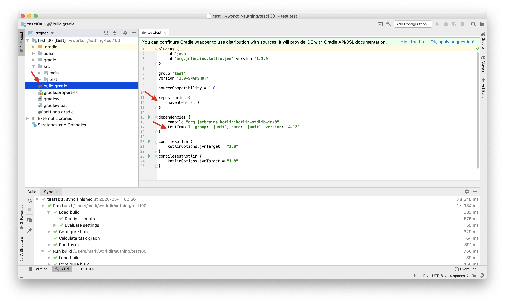

# Authing SDK for Java

[中文](./README-cn.md)

Authing SDK version 2.0.1

JDK version 1.8

Github address: [https://github.com/Authing/authing-java-sdk](https://github.com/Authing/authing-java-sdk)

JCenter: [https://bintray.com/authing/AuthingSDK/Java](https://bintray.com/authing/AuthingSDK/Java)

# Installation

## Create project

Create a new project in IDEA


Select Gradle and check Java and Kotlin in the extra dependencies on the right:


Fill in other information:


## Adding dependencies

Enter the IDE and wait for Gradle to finish building. Open the build.gradle file:



Add the following to the red arrow on the right:

```text
implementation "cn.authing:java-core:2.0.1"
```

# Quick start

First get the `UserPool ID` and `Secret` from the Authing console, and then instantiated the `Authing` class.

```java
import cn.authing.core.Authing;

public class Demo {
    public static void main(String[] args) {
        // Optional parameters:
        // Secret: This key is used to obtain user pool administrator privileges. It should be properly saved. Please do not pass it in the client
        // AccessToken: The user's authentication credentials, which are necessary parameters to invoke some interfaces, can be obtained by calling the login interface, after obtaining can be passed in.
        // Host：Authing's interface address, which defaults to https://core.authing.cn, will need to be changed after you privatise deployment
        // PublicKey：The encrypted public key, which defaults to Authing's public key, needs to be modified after privatization of deployment. The public key format is as follows:
        // 
        // MIGfMA0GCSqGSIb3DQEBAQUAA4GNADCBiQKBgQC4xKeUgQ+Aoz7TLfAfs9+paePb
        // 5KIofVthEopwrXFkp8OCeocaTHt9ICjTT2QeJh6cZaDaArfZ873GPUn00eOIZ7Ae
        // +TiA2BKHbCvloW3w5Lnqm70iSsUi5Fmu9/2+68GZRH9L7Mlh8cFksCicW2Y2W2uM
        // GKl64GDcIq3au+aqJQIDAQAB
        //
        Authing client = new Authing("userPoolId", "secret");
    }
}
```

# How to build a parameter object

The SDK interface function parameter object provides two ways to initialize:

## Chain call mode (recommended)

```java
import cn.authing.core.Authing;
import cn.authing.core.types.*;

public class Demo {
    public static void main(String[] args) {
        LoginByEmailParam param = new LoginByEmailParam().email("email").password("password").build();
    }
}
```

## Setter mode

```java
import cn.authing.core.Authing;
import cn.authing.core.types.*;

public class Demo {
    public static void main(String[] args) {
        LoginByEmailParam param = new LoginByEmailParam();
        param.setEmail("email");
        param.setPassword("password");
        param.build();
    }
}
```

# SDK Overview

The Authing SDK provides authorization service(OAuthService), user service(UserService), user management service(UserManageService) and verification service(VerifyService).You can directly obtain related information through Authing.getOAuthService, Authing.getUserService, Authing.getUserManageService, Authing.getVerifyService Instance.

# How to call

## Call synchronously

The SDK provides two calling methods: **synchronous** and **asynchronous**, which are suitable for different scenarios.

If you need to wait for the result to process the subsequent data, it is more suitable for synchronous call, for example:

```java
import cn.authing.core.Authing;
import cn.authing.core.types.*;

public class Demo {
    public static void main(String[] args) {
        Authing client = new Authing("userPoolId", "secret");
        LoginByEmailResponse response = client.loginByEmail(new LoginByEmailParam().email("email").password("password").build()).execute();
        System.out.println(response.getResult().getEmail());
    }
}
```

## Asynchronous call

If you don't want to block the current thread, you need to use asynchronous calls(of course you can also use synchronous calls in child threads), for example:

```java
import cn.authing.core.Authing;
import cn.authing.core.http.Callback;
import cn.authing.core.types.*;

public class Demo {
    public static void main(String[] args) {
        Authing client = new Authing("userPoolId", "secret");
        client.loginByEmail(new LoginByEmailParam().email("email").password("password").build()).enqueue(
        new Callback<LoginByEmailResponse>() {
            @Override
            public void onSuccess(LoginByEmailResponse response) {
                response.getResult().getEmail();
            }

            @Override
            public void onFailure(ErrorInfo errorInfo) {
                System.out.println(errorInfo.getCode());
                System.out.println(errorInfo.getMessage());
            }    
        });
    }
}
```

# Error handling

Synchronous calls throw errors, asynchronous calls return errors in 'onFailure', you can get the error code by`error.getCode()`. For more details on error reporting, please see the [list of error codes](https://github.com/Authing/authing-java-sdk/blob/master/README.md#error-code).

# User service

## User register

client.register(RegisterParam params)

You need to choose one of the following ways:

- Phone number + captcha to register
- Phone number + password registration
- Email + password registration
- User name + password registration

Params {RegisterParam}
- Email {String}, optional, user mailbox
- ams.username {String}, optional, username
- params.password {String}, optional, user password
- Params.phone {String}, optional, phone number
- Ams.phonecode {String}, optional, SMS verification code
- Params.com Pany {String}, optional, Company
- Ams.lastip {String}, optional, last login IP address
- Ams.oauth {String}, optional, user social login information or other custom data
- Params.photo {String}, optional, avatar

Example:

```java
import cn.authing.core.Authing;
import cn.authing.core.types.*;

import java.io.IOException;

public class Demo {
    public static void main(String[] args) throws IOException {
        Authing client = new Authing("userPoolId", "secret");
        
        // register use name and password
        UserRegisterInput input = new UserRegisterInput().username("username").password("123456").build();

        // register use email and password
        // UserRegisterInput input = new UserRegisterInput().email("email").password("123456").build();

        // register use phone and password
        // UserRegisterInput input = new UserRegisterInput().phone("phone").password("123456").build();

        // register use phone and phone code
        // UserRegisterInput input = new UserRegisterInput().phone("phone").phoneCode("1234").build();

        RegisterResponse response = client.register(new RegisterParam().userInfo(input).build()).execute();
        System.out.println(response.getResult().get_id());
    }
}
```

## The user pool administrator logs in

client.loginBySecret()

This interface returns the administrator's accessToken, which can be passed into the client to access certain higher-privilege interfaces.

Example:

```java
import cn.authing.core.Authing;
import cn.authing.core.types.*;

public class Demo {
    public static void main(String[] args) throws IOException {
        Authing client = new Authing("userPoolId", "secret");
        client.setAccessToken(client.loginBySecret().execute().getResult());
    }
}
```

## Login by Email + Password

client.loginByEmail(params)

- params {LoginByEmailParam}
  - params.email {String}, required, user email
  - params.password {String}, required, user password

Example:

```java
import cn.authing.core.Authing;
import cn.authing.core.types.*;

import java.io.IOException;

public class Demo {
    public static void main(String[] args) throws IOException {
        Authing client = new Authing("userPoolId", "secret");
        LoginByEmailParam param = new LoginByEmailParam().email("email").password("123456").build();
        LoginByEmailResponse response = client.loginByEmail(param).execute();
        System.out.println(response.getResult().getEmail());
    }
}
```

## Login by user name + password

client.loginByUsername(params)

- params {LoginByUsernameParam}
  - params.username {String}, required, user name
  - params.password {String}, required, user password

示例：

```java
import cn.authing.core.Authing;
import cn.authing.core.types.*;

import java.io.IOException;

public class Demo {
    public static void main(String[] args) throws IOException {
        Authing client = new Authing("userPoolId", "secret");
        LoginByUsernameParam param = new LoginByUsernameParam().username("username").password("123456").build();
        LoginByUsernameResponse response = client.loginByUsername(param).execute();
        System.out.println(response.getResult().getEmail());
    }
}
```

## Login by Phone + VerifyCode

client.loginByPhone(params)

- params {LoginByPhoneCodeParam}
  - params.phone {String}, phone number
  - params.phoneCode {Int}, SMS verification code

Example:

```java
import cn.authing.core.Authing;
import cn.authing.core.types.*;

import java.io.IOException;

public class Demo {
    public static void main(String[] args) throws IOException {
        Authing client = new Authing("userPoolId", "secret");
        LoginByPhoneCodeParam param = new LoginByPhoneCodeParam().phone("phone").phoneCode(1234).build();
        LoginByPhoneCodeResponse response = client.loginByPhoneCode(param).execute();
        System.out.println(response.getResult().getEmail());
    }
}
```

## Login by Phone + Password

client.loginByPhonePassword(params)

- params {LoginByPhonePasswordParam}
  - params.phone {String}, phone number
  - params.password {Int}, user password

示例：

```java
import cn.authing.core.Authing;
import cn.authing.core.types.*;

import java.io.IOException;

public class Demo {
    public static void main(String[] args) throws IOException {
        Authing client = new Authing("userPoolId", "secret");
        LoginByPhonePasswordParam param = new LoginByPhonePasswordParam().phone("phone").password("123456").build();
        LoginByPhonePasswordResponse response = client.loginByPhonePassword(param).execute();
        System.out.println(response.getResult().getEmail());
    }
}
```

## LDAP login

userService.loginByLDAP(params)

- params {Object}
  - params.username {String}, required, username
  - params.password {String}, required, password

Example:

```java
import cn.authing.core.Authing;
import cn.authing.core.types.*;

import java.io.IOException;

public class Demo {
    public static void main(String[] args) throws IOException {
        Authing client = new Authing("userPoolId", "secret");
        LoginByLdapParam param = new LoginByLdapParam().username("phone").password("123456").build();
        LoginByLdapResponse response = client.loginByLdap(param).execute();
        System.out.println(response.getResult().getEmail());
    }
}
```

## Refresh Access Token

Require the user pool administrator's AccessToken.

client.refreshToken(params)

- params {RefreshTokenParam}
  - params.user {String}, required, user id

Example:

```java
import cn.authing.core.Authing;
import cn.authing.core.types.*;

import java.io.IOException;

public class Demo {
    public static void main(String[] args) throws IOException {
        Authing client = new Authing("userPoolId", "secret");
        client.setAccessToken(client.loginBySecret().execute().getResult());
        System.out.println(client.refreshToken(new RefreshTokenParam().user("user id").build()).execute());
    }
}
```

## Get user information

client.user(params)

Need AccessToken.

Ordinary users can only query their own information, user pool administrator can query all user information under the user pool

- params {UserInfoParam}
  - params.id {String}, optional, user ID
  - params.token {String}, optional, user AccessToken

Example:

```java
import cn.authing.core.Authing;
import cn.authing.core.types.*;

import java.io.IOException;

public class Demo {
    public static void main(String[] args) throws IOException {
        Authing client = new Authing("userPoolId", "secret");
        // 获取管理员权限
        client.setAccessToken(client.loginBySecret().execute().getResult());
        System.out.println(client.user(new UserParam().id("user id").build()).execute());
    }
}
```

## Update user information

client.updateUser(params)

Need AccessToken.

Ordinary users can only update their own information. The user pool administrator can update all user information under the user pool.
Administrators can also directly update the user's phone number or password through this interface

- params {UserUpdateInput}
  - params._id {userId}, required, user ID
  - params.blocked {Boolean}, optional, whether to be locked
  - params.browser {String}, optional, browser information
  - params.company {String}, optional, company
  - params.email {String}, optional, email
  - params.emailVerified {Boolean}, optional, whether the mailbox is verified
  - params.lastLogin {String}, optional, last login time
  - params.lastIP {String}, optional, last login IP address
  - params.loginsCount {Int}, optional, number of logins
  - params.nickname {String}, optional, nickname
  - params.signUp {String}, optional, registration time
  - params.photo {String}, optional, avatar
  - params.password {String}, optional, password
  - params.token {String}, optional, Authing Token
  - params.tokenExpiredAt {String}, optional, expiration time of Authing Token
  - params.username {String}, optional, username

Example:

```java
import cn.authing.core.Authing;
import cn.authing.core.types.*;

import java.io.IOException;

public class Demo {
    public static void main(String[] args) throws IOException {
        Authing client = new Authing("userPoolId", "secret");

        client.setAccessToken(client.loginBySecret().execute().getResult());
        UserUpdateInput options = new UserUpdateInput()._id("user id").nickname("nickname").build();
        System.out.println(client.updateUser(new UpdateUserParam().options(options).build()).execute());
    }
}
```

## Update user phone number

client.updatePhone(params)

Need AccessToken.

The console can be configured to fill in the old phone number and verification code.

The administrator can directly call the updateUser interface to change the phone number.

- params {UpdatePhoneParam}
  - params.phone {String}, required, new cell phone number
  - params.phoneCode {String}, required, captcha sent to the new phone number
  - params.oldPhone {String}, required, old cell phone number
  - params.oldPhoneCode {String}, optional, captcha sent to the old phone number

Example:

```java
import cn.authing.core.Authing;
import cn.authing.core.types.*;

import java.io.IOException;

public class Demo {
    public static void main(String[] args) throws IOException {
        Authing client = new Authing("userPoolId", "secret");

        LoginByEmailResponse response = client.loginByEmail(new LoginByEmailParam().email("email").password("123456").build()).execute();
        client.setAccessToken(response.getResult().getToken());

        System.out.println(client.updatePhone(new UpdatePhoneParam().phone("phone").phoneCode("1234").build()).execute());
    }
}
```

## Query user login status

client.checkLoginStatus(params)

Need AccessToken.

- params {CheckLoginStatusParam}
  - params.token {String}, required, user AccessToken

Example:

```java
import cn.authing.core.Authing;
import cn.authing.core.types.*;

import java.io.IOException;

public class Demo {
    public static void main(String[] args) throws IOException {
        Authing client = new Authing("userPoolId", "secret");
    
        // 获取普通用户的 accessToken
        LoginByEmailResponse response = client.loginByEmail(new LoginByEmailParam().email("email").password("123456").build()).execute();
        client.setAccessToken(response.getResult().getToken());

        System.out.println(client.checkLoginStatus(new CheckLoginStatusParam().token(user.getToken()).build()).execute());
    }
}
```

## reset Password

client.resetPassword(params)

Need AccessToken.

The user pool administrator can directly call the updateUser interface to change the password.

- params {ResetPasswordParam}
  - params.email {String}, required, user email
  - params.password {String}, required, user's new password
  - params.verifyCode {String}, required, verification code

Example:

```java
import cn.authing.core.Authing;
import cn.authing.core.types.*;

import java.io.IOException;

public class Demo {
    public static void main(String[] args) throws IOException {
        Authing client = new Authing("userPoolId", "secret");

        // 获取普通用户的 accessToken
        LoginByEmailResponse response = client.loginByEmail(new LoginByEmailParam().email("email").password("123456").build()).execute();
        client.setAccessToken(response.getResult().getToken());

        System.out.println(client.resetPassword(new ResetPasswordParam().email("email").password("password").verifyCode("123456").build()).execute());
    }
}
```

# Authorization service

## Unbind email

client.unbindEmail(params)

Need AccessToken.

You need to have bound another login, such as username + password

- params {UnbindEmailParam}
  - params.user {String}, required, user ID

Example:

```java
import cn.authing.core.Authing;
import cn.authing.core.types.*;

import java.io.IOException;

public class UnBindEmail {
    public static void main(String[] args) throws IOException {
        Authing client = new Authing("userPoolId", "secret");

        // 获取普通用户的 accessToken
        LoginByEmailResponse response = client.loginByEmail(new LoginByEmailParam().email("email").password("123456").build()).execute();
        client.setAccessToken(response.getResult().getToken());
    
        System.out.println(client.unbindEmail(new UnbindEmailParam().user("user id").build()).execute());
    }
}
```

## Read the social login list opened by the user pool

client.readOAuthList()

Require the user pool administrator's AccessToken.

Example:

```java
import cn.authing.core.Authing;
import cn.authing.core.types.*;

import java.io.IOException;
import java.util.List;

public class Demo {
    public static void main(String[] args) throws IOException {
        Authing client = new Authing("userPoolId", "secret");

        // 获取管理员权限
        client.setAccessToken(client.loginBySecret().execute().getResult());

        System.out.println(client.readOauthList(new ReadOauthListParam().build()).execute());
    }
}
```

# Authentication service

## Send Email Verification Email

client.sendVerifyEmail(params)

- params {SendVerifyEmailParam}
  - params.email {String}, required, email address

Example:

```java
import cn.authing.core.Authing;
import cn.authing.core.types.*;

import java.io.IOException;

public class Demo {
    public static void main(String[] args) throws IOException {
        Authing client = new Authing("userPoolId", "secret");

        client.sendVerifyEmail(new SendVerifyEmailParam().email("email").build()).execute();
    }
}
```

## Send mobile verification code

client.sendPhoneVerifyCode(phone)

- phone {String}, required, phone number

Example:

```java
import cn.authing.core.Authing;
import cn.authing.core.types.*;

import java.io.IOException;

public class Demo {
    public static void main(String[] args) throws IOException {
        Authing client = new Authing("userPoolId", "secret");
        System.out.println(client.sendPhoneVerifyCode("phone").execute());
    }
}
```

## Send password reset email

client.sendResetPasswordEmail(params)

- params {SendResetPasswordEmailParam}
  - params.email {String}, required, email address

Example:

```java
import cn.authing.core.Authing;
import cn.authing.core.types.*;

import java.io.IOException;

public class Demo {
    public static void main(String[] args) throws IOException {
        Authing client = new Authing("userPoolId", "secret");
        client.sendResetPasswordEmail(new SendResetPasswordEmailParam().email("email").build()).execute();
    }
}
```

## Verification code for reset password

client.verifyResetPasswordCode(params)

- params {verifyResetPasswordCode}
  - params.email {String}, required, email address
  - params.verifyCode {String}, required, verification code

Example:

```java
import cn.authing.core.Authing;
import cn.authing.core.types.*;

import java.io.IOException;

public class Demo {
    public static void main(String[] args) throws IOException {
        Authing client = new Authing("userPoolId", "secret");

         System.out.println(client.verifyResetPasswordCode(new VerifyResetPasswordVerifyCodeParam().email("email").verifyCode("verifyCode").build()).execute());
    }
}
```

# User management services

## Get user information in batches

client.userPatch(params)

Require the user pool administrator's AccessToken.

- params {UserPatchParam}
  - params.ids {String}, required, The list of user ids to query, separated by commas, such as: ID1, ID2, ID3

Example:

```java
import cn.authing.core.Authing;
import cn.authing.core.types.*;

import java.io.IOException;

public class Demo {
    public static void main(String[] args) throws IOException {
        Authing client = new Authing("userPoolId", "secret");

        String token = client.loginBySecret().execute().getResult();
        client.setAccessToken(token);

        System.out.println(client.userPatch(new UserPatchParam().ids("id1,id2,id3").build()).execute());
    }
}
```

## Get user list

client.users(params)

Require the user pool administrator's AccessToken.

- params {Object}
  - params.page {Int}, optional, default is 1
  - params.count {Int}, optional, default is 10

Example:

```java
import cn.authing.core.Authing;
import cn.authing.core.types.*;

import java.io.IOException;

public class Demo {
    public static void main(String[] args) throws IOException {
        Authing client = new Authing("userPoolId", "secret");

        String token = client.loginBySecret().execute().getResult();
        client.setAccessToken(token);

        System.out.println(client.users(new UsersParam().page(1).count(2).build()).execute());
    }
}
```

## delete users

client.removeUser(params)

Require the user pool administrator's AccessToken.

- params {Object}
  - params.userId, required, list of user ID

Example:

```java
import cn.authing.core.Authing;
import cn.authing.core.types.*;

import java.io.IOException;
import java.util.ArrayList;
import java.util.List;

public class RemoveUser {
    public static void main(String[] args) throws IOException {
        Authing client = new Authing("userPoolId", "secret");

        String token = client.loginBySecret().execute().getResult();
        client.setAccessToken(token);

        List<String> ids = new ArrayList<String>();
        ids.add(user.get_id());
        System.out.println(client.removeUsers(new RemoveUsersParam().ids(ids).build()).execute());
    }
}
```

# Error code

The format of the error code response is as follows:

```json
{
  "message": "System is busy, please try again later",
  "code": 1000,
  "data": null
}
```

| ErrCode | Description                                                                                                                                                   |
| :------ | :------------------------------------------------------------------------------------------------------------------------------------------------------------ |
| 1000    | System is busy, please try again later.                                                                                                                       |
| 1001    | Operation is not permitted.                                                                                                                                   |
| 2000    | Too many failures, please input captcha.                                                                                                                      |
| 2001    | Capcha is wrong.                                                                                                                                              |
| 2002    | Monthly login counts exceeded.                                                                                                                                |
| 2003    | Wrong E-mail format when login or register.                                                                                                                   |
| 2004    | User doesn't exists.                                                                                                                                          |
| 2005    | User has been blocked.                                                                                                                                        |
| 2006    | Wrong password.                                                                                                                                               |
| 2007    | Invalid App name.                                                                                                                                             |
| 2008    | App name is duplicated.                                                                                                                                       |
| 2009    | Invalid App type.                                                                                                                                             |
| 2010    | Need UserPool ID.                                                                                                                                             |
| 2011    | App doesn't exsists.                                                                                                                                          |
| 2012    | Missing default user group.                                                                                                                                   |
| 2013    | Invalid App description.                                                                                                                                      |
| 2014    | Wrong pattern when searching user.                                                                                                                            |
| 2015    | Invalid type when searching user.                                                                                                                             |
| 2016    | Password decryption is failed.                                                                                                                                |
| 2017    | Failed to parse the meta_data of the E-mail template.                                                                                                         |
| 2018    | User doesn't have permission to modify the content.                                                                                                           |
| 2019    | Need verification when changing password.                                                                                                                     |
| 2020    | Not logged in. No permission to request.                                                                                                                      |
| 2021    | Failed to send E-mail. Reason: Can't get E-mail template.                                                                                                     |
| 2022    | Failed to verify user E-mail. Reason: Can't get E-mail template.                                                                                              |
| 2023    | Failed to verify user E-mail. Reason: Verification link is expired and should be sent again.                                                                  |
| 2024    | Project description text can't exceed 140 characters.                                                                                                         |
| 2025    | Failed to use default E-mail provider.                                                                                                                        |
| 2026    | User exists, please do not re-register.                                                                                                                       |
| 2027    | User is registered with social login and no password is set. Please login by social account.                                                                  |
| 2028    | Please provide correct phone number or E-mail.                                                                                                                |
| 2029    | Password must be at least 6 characters.                                                                                                                       |
| 2030    | No more than 80 users can be searched at one time.                                                                                                            |
| 2031    | User registration has been forbidden in this user pool。.                                                                                                     |
| 2032    | Password required during registration.                                                                                                                        |
| 2100    | Registration is too frequent, please try again later.                                                                                                         |
| 2101    | Please provide UserPool ID.                                                                                                                                   |
| 2200    | This E-mail already exists, please change it.                                                                                                                 |
| 2201    | Please enter the original password.                                                                                                                           |
| 2202    | The modified information does not belong to the current user.                                                                                                 |
| 2203    | Wrong original password.                                                                                                                                      |
| 2204    | E-mail format is incorrect.                                                                                                                                   |
| 2205    | Missing parameters：registerInClient.                                                                                                                         |
| 2206    | Login information has expired, you need to log in again.                                                                                                      |
| 2207    | Incorrect login information, you need to log in again.                                                                                                        |
| 2208    | Please use a different mailbox from your existing one.                                                                                                        |
| 2209    | No permission to delete this user.                                                                                                                            |
| 2210    | An incorrect deletion operation was performed, possibly due to an intention to delete a user who does not exist, or other errors occurred during the deletion |
| 2211    | Missing parameter: username (user username).                                                                                                                  |
| 2212    | Cannot delete root user.                                                                                                                                      |
| 2213    | When trying to bind a third-party social login method, it is found that this method has been bound.                                                           |
| 2214    | Failed to read the bound social login method.                                                                                                                 |
| 2215    | When trying to bind a third-party social login method, the account to be bound has already been bound.                                                        |
| 2216    | When attempting to unbind a third-party social login method, no such social login was bound.                                                                  |
| 2217    | When attempting to unbind a third-party social login method or E-mail, there is only one login method, so it cannot be unbound.                               |
| 2218    | When trying to change the password, the E-mail is not bound and cannot be modified.                                                                           |
| 2219    | This user did not bind an E-mail when trying to unbind the E-mail.                                                                                            |
| 2220    | This application name already exists when trying to create or update an LDAP Server.                                                                          |
| 2221    | App doesn't exist when trying to update OAuth App.                                                                                                            |
| 2222    | Reserved domain name used when trying to create or update OAuth Provider information.                                                                         |
| 2223    | When attempting to create OAuth Provider, an already used domain name was used.                                                                               |
| 2300    | Expired verify code.                                                                                                                                          |
| 3012    | Macro command execution error.                                                                                                                                |
| 3013    | Failed to send E-mail, unknown error.                                                                                                                         |
| 3014    | Failed to send E-mail. Reason: unable to get transporter.                                                                                                     |
| 3617    | No permission to add collaborators.                                                                                                                           |
| 3618    | No permission to add permission items.                                                                                                                        |
| 3619    | Not authorized to view user pool information for the user participating in collaboration.                                                                     |
| 3620    | Collaborators already exist.                                                                                                                                  |
| 3621    | No permission to delete collaboration.                                                                                                                        |
| 3622    | No permission to view the list of collaborators.                                                                                                              |
| 3623    | Collaboration does not exist.                                                                                                                                 |
| 3624    | No permission to modify collaborators.                                                                                                                        |
| 3829    | This second level domain is already used.                                                                                                                     |
| 4212    | OIDC Provider does not exist.                                                                                                                                 |
| 5000    | Failed to get the user pool corresponding to the order.                                                                                                       |
| 5001    | Order does not exist.                                                                                                                                         |
| 5022    | Order creation failed.                                                                                                                                        |
| 5023    | Alipay order creation failed.                                                                                                                                 |
| 5024    | Order creation failed, unknown error.                                                                                                                         |
| 5025    | Order creation failed: invalid price.                                                                                                                         |
| 7348    | SAML SP application does not exist.                                                                                                                           |
| 8128    | Error happened when returning SAML Assertion.                                                                                                                 |
